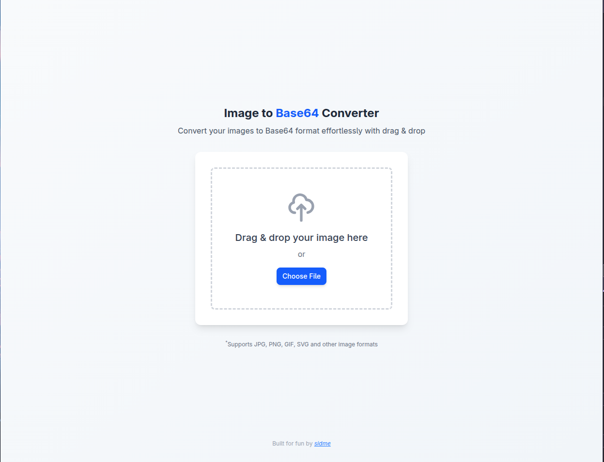

# Just For Fun

## JS Dev Tools

Combination of multiple small tools for JavaScript developers.

### - Image to Base 64 Converter

### - Image converter

Try it out [here](https://image-to-base64-sidme.vercel.app/).

## Tech Stack

- React with TypeScript
- React Router DOM for routing
- Tailwind CSS for styling
- RsBuild as the build tool

## Usage

1. Click on the "Choose Image" button to select an image file from your device.
2. The selected image will be converted to a Base 64 string and displayed in the textarea.
3. You can copy the Base 64 string to your clipboard using the "Copy" button.
